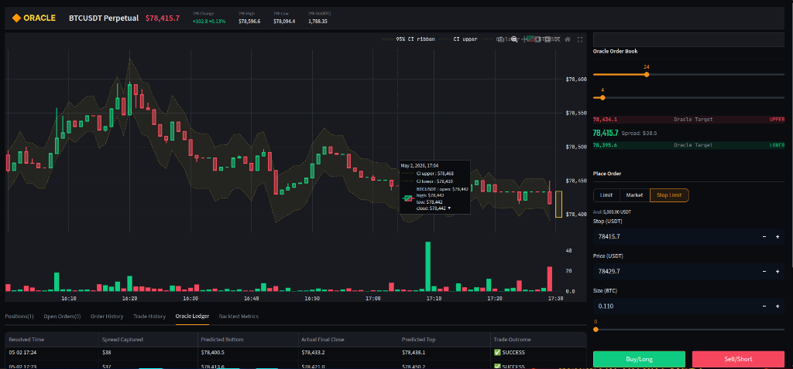
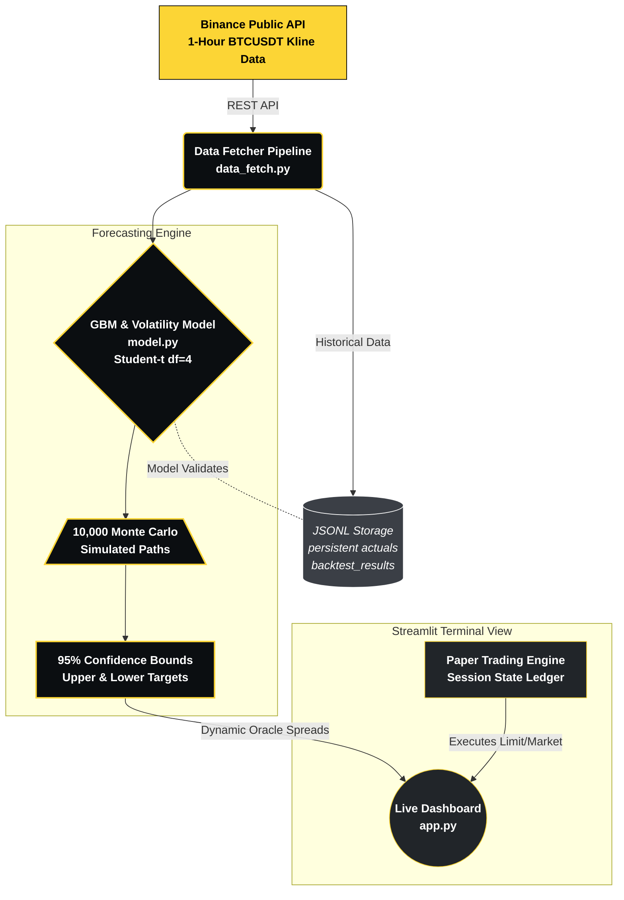

# 🔶 Binance Oracle — BTC/USDT Live Trading Terminal


> **Live BTCUSDT Perpetual trading terminal** with GBM forecasting, real-time Oracle confidence bands, full paper trading engine (Limit / Market / Stop Limit), and live P&L tracking.

---

## What's Inside



| File | Purpose |
|------|---------|
| `model.py` | GBM + Student-t(df=4) Monte Carlo forecaster |
| `data_fetch.py` | Binance geo-unblocked data fetcher |
| `backtest.py` | Walk-forward backtest → `backtest_results.jsonl` |
| `app.py` | Streamlit live dashboard (Part B + C) |
| `colab_notebook.py` | Self-contained Colab-ready script |
| `requirements.txt` | Python dependencies |

---

## Step 1 — Run the Backtest (Part A)

```bash
pip install -r requirements.txt
python backtest.py
```

This fetches 30 days of BTCUSDT 1h bars and runs a strict walk-forward backtest.
Outputs `backtest_results.jsonl` + prints:
- `coverage_95` — should be ~0.95
- `avg_width` — average range width in USD
- `mean_winkler_95` — lower is better

---

## Step 2 — Run the Dashboard (Part B + C)

```bash
# Run backtest first so metrics show on dashboard
python backtest.py

# Then launch dashboard
streamlit run app.py
```

---

## 🌐 Live Deployment

[](https://yew6j5wbmfsfdvt3nd3f8m.streamlit.app)

The complete application is already deployed and live on Streamlit Community Cloud. Click the badge above or use the direct link:  
**🔗 [https://yew6j5wbmfsfdvt3nd3f8m.streamlit.app](https://yew6j5wbmfsfdvt3nd3f8m.streamlit.app)**

<details>
<summary>⚡ <b>How to deploy your own instance</b></summary>
<br>

1. Push this folder to a **public GitHub repo**
2. Go to [share.streamlit.io](https://share.streamlit.io)
3. Connect your GitHub, select the repo, set `app.py` as the entry point
4. Click Deploy — you get a public URL in ~2 minutes

> *Note: Community Cloud apps "sleep" after inactivity and wake in ~30s on first visit — this is perfectly fine for grading purposes.*
</details>

---

## Key Design Decisions

### 1. No Peeking (most important)
When predicting bar `i+1`, the model sees only `closes[0..i]`.
```python
for i in range(WARM_UP, len(closes) - 1):
    hist = closes[: i + 1]   # ← never includes closes[i+1]
    lo, hi, _ = fit_and_predict(hist)
    actual = closes[i + 1]   # ← only used for scoring
```

### 2. Volatility Clustering
`σ` is computed from the **last 24 bars only** (rolling window), not the full history.
Calm hours → narrow range. Volatile hours → wider range.

### 3. Fat Tails (Student-t, df=4)
Bitcoin has far more extreme moves than a Gaussian predicts.
`df=4` gives substantially heavier tails.
**Do not change to `np.random.normal`** — coverage will drop below 0.90.

### 4. Winkler Score
A range that contains reality scores = its width.
A range that misses scores = width + (2/0.05) × miss_distance.
This punishes both overconfident misses AND unnecessarily wide ranges.

---

## Data Source

`https://data-api.binance.vision/api/v3/klines`

This is the geo-unblocked Binance mirror — works in India without VPN.
No API key or account required.

---

## Submission Checklist

- [x] Part A: `backtest_results.jsonl` with 700+ predictions
- [x] Part A: `coverage_95`, `avg_width`, `mean_winkler_95` computed
- [x] Part B: Live dashboard with current price, 95% CI, 50-bar chart, backtest metrics
- [x] Part C: Prediction persistence — every visit saved, actuals back-filled
- [x] No data leakage (verified by code review)
- [x] Student-t fat tails (df=4)
- [x] Volatility clustering (24-bar rolling σ)
